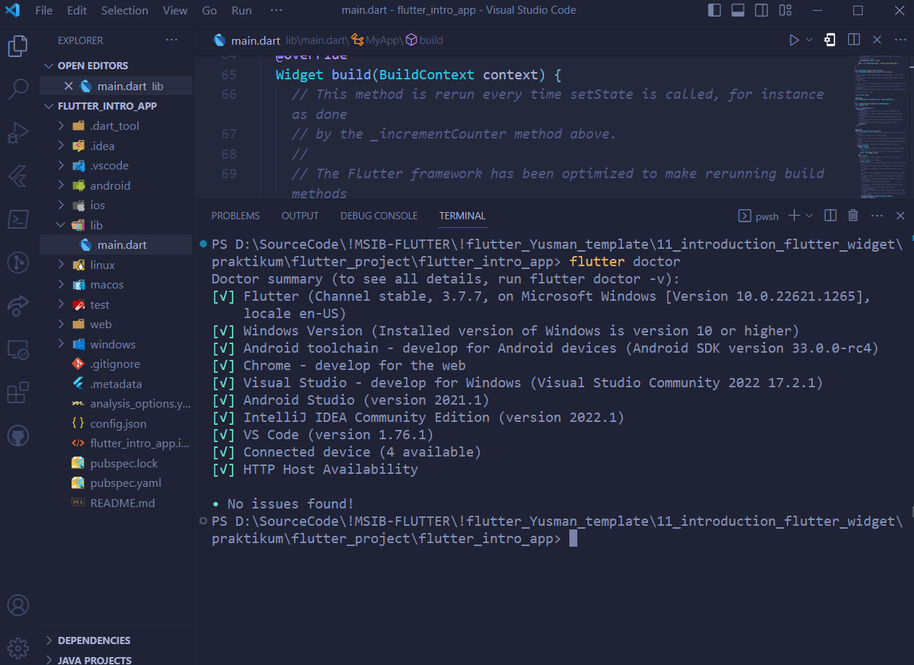

### Soal Prioritas 1 (80)

1. Sebutkan 3 aplikasi yang dibangun menggunakan teknologi Flutter! lalu screenshot
   - OVO  
      Merupakan aplikasi dompet digital di indonesia yang menggunakan Flutter dalam pengembangan aplikasi mobile-nya.
       
      |              |
      |--------------|
      |  |
   - Gojek  
      Merupakan aplikasi transportasi online dan beberapa layanan lainnya. Menggunakan Flutter dalam pengembangan aplikasi mobile-nya.
       
      |              |
      |--------------|
      |  |
    - Tokopedia  
      Merupakan aplikasi belanja online di Indonesia. Menggunakan Flutter dalam pengembangan aplikasi mobile-nya.
       
      |              |
      |--------------|
      |  |
2. Tampilkan informasi software yang dibutuhkan oleh Flutter dengan menggunakan perintah Flutter doctor! lalu screenshot
  - Software yang digunakan/install:
    - flutter 3.7.7
    - Android SDK 33.0.0-rc4
    - Chrome
    - Windows 11
    - vs code 1.76.1
    - visual studio Community 2022
    - Android Studio 2021
    - Intellij IDEA Community 2022
    - HTTP host
       
      |              |
      |--------------|
      |  |
3. Buatlah sebuah project flutter (jika flutter berhasil dibuat tapi masih belum bisa tampil, maka masuk ke nilai prioritas 1)
       
      |              |
      |--------------|
      |  |

### Soal Prioritas 2 (20)

1. Setelah project dibuat, jalankan di emulator 
       
      |              |
      |--------------|
      |  |
    
