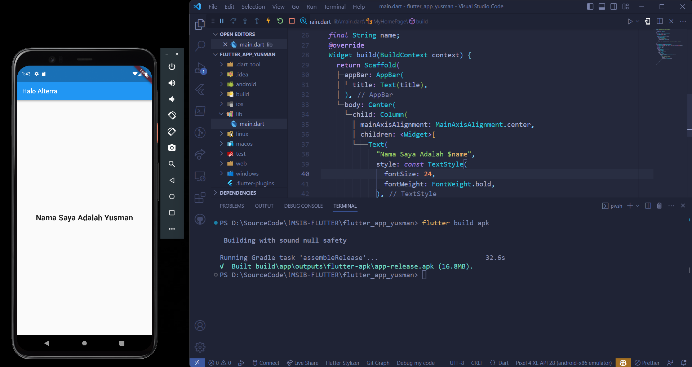

### Soal Prioritas 1 (80)

1. Instal paket pada proyek Flutter menggunakan Flutter CLI:
    - Instruksi: flutter packages get
    - Contoh: flutter packages get
    
    |              |
    |--------------|
    |  |

2. Hapus paket pada proyek Flutter menggunakan Flutter CLI:
    - Instruksi: flutter remove nama_paket
    - Contoh: flutter remove path_provider
    
    |              |
    |--------------|
    |  |
    
3. Aktifkan Hot Reload pada proyek Flutter menggunakan Flutter CLI:
    - Instruksi: flutter run --hot-reload
    - Contoh: flutter run --hot-reload
     
    |              |
    |--------------|
    |  |

4. Buat APK atau IPA untuk proyek Flutter menggunakan Flutter CLI:
    - Instruksi: flutter build apk (untuk Android) atau flutter build ios (untuk iOS)
    - Contoh: flutter build apk
    
    |    CLI       |
    |--------------|
    |  |
    |  Folder file apk  |
    |  |
    
5. Bersihkan cache pada proyek Flutter menggunakan Flutter CLI:
   - Instruksi: flutter clean
   - Contoh: flutter clean
  
   |              |
   |--------------|
   |  |
   
### Soal Prioritas 2 (20)
1. Modifikasi project yang telah kalian buat sehingga mengubah Appbar dengan tulisan “Halo Alterra” dan di halaman bodynya berisi tulisan “Nama saya adalah (NamaKalian)”
   |              |
   |--------------|
   |  |
