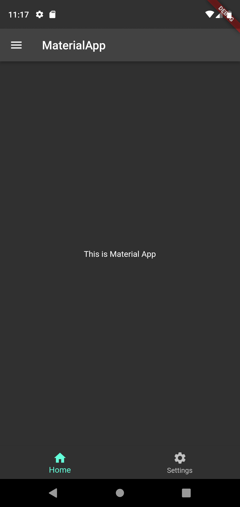
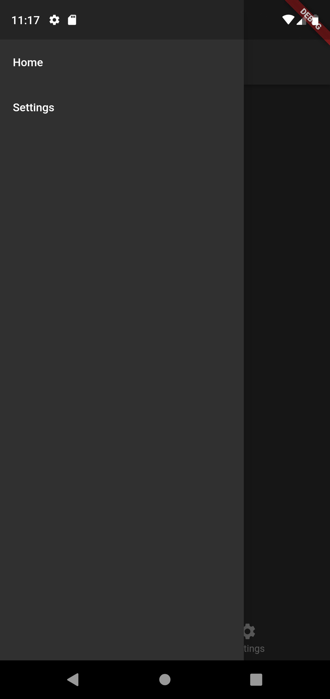
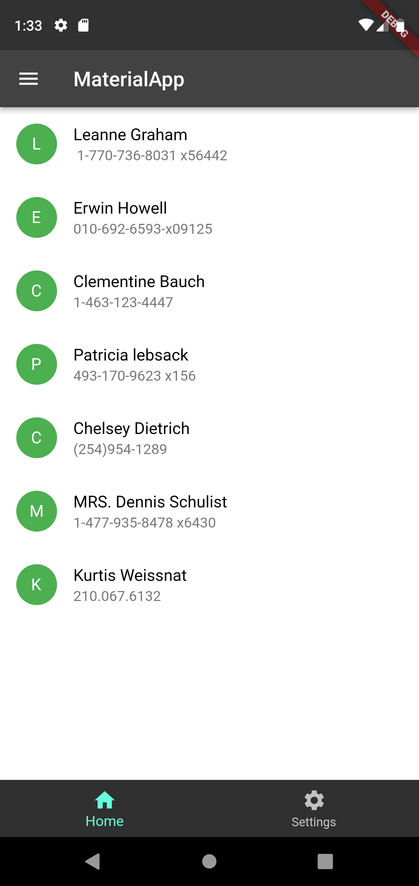
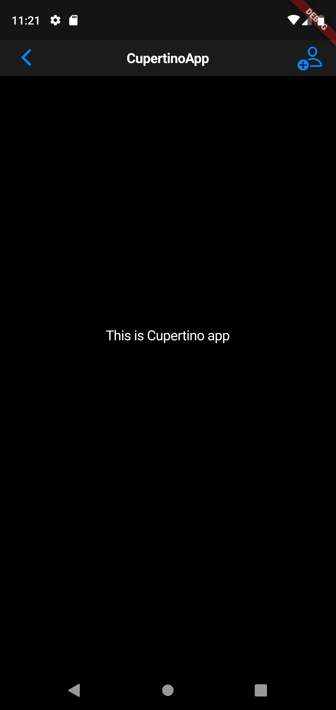
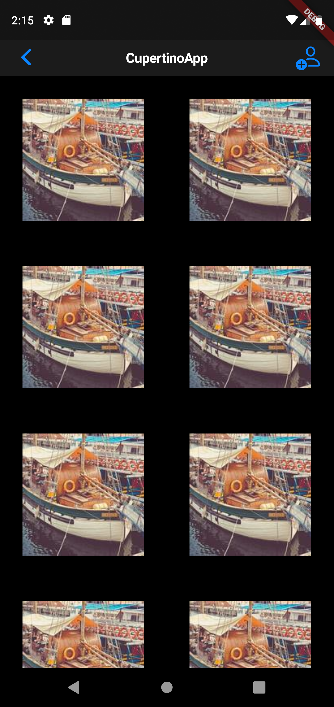
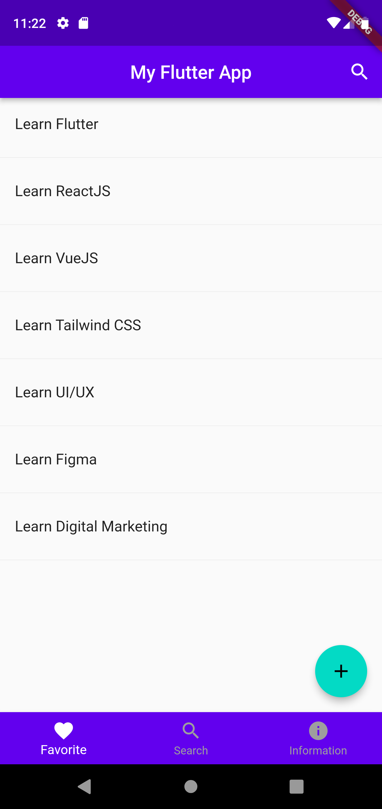

### Soal Prioritas 1 (80)
1. Membuat tampilan OS Android (Material Design)
    - Buatlah tampilan berikut ini menggunakan flutter material. Harus terdiri dari beberapa hal
    - Appbar dengan tulisan material App
    - Body bertuliskan "this is material app"
    - BottomnavigationBar. terdiri dari dua button (belum harus berfungsi hanya tampilan)
    - Warna sama persis dengan contoh gambar

        |Tampilan hasil|
        |--------------|
        |  |
        
    - buatlah tampilan berikut ini menggunakan flutter material. harus etrdiri beberapa hal
    - Ketika drawer ditekan maka akan  muncul text setting
    - terdapat tulisan home pada atas drawer
    - warna hitam (sesuai pada layar)
    - NOTE: navigation tidak harus berfungsi, button tidak harus berfungsi. poin pada penilaian ini adalah pemakaian widget bukan fungsionalitas widget yang ada.
    
        |Tampilan hasil|
        |--------------|
        |  |
        
    -  Setelah berhasil membuat sebuah tampilan OS Android dan di screenshot. ubah tampilan pada body aplikasi menjadi seperti dibawah ini menggunakan LISTVIEW

        |Tampilan hasil|
        |--------------|
        |  |
        
 ### Soal Prioritas 2 (20)
 2. Membuat tampilan OS IOS (Cupertino Design)
    - buatlah tampilan berikut ini menggunakan flutter material. harus terdiri dari beberapa hal
    - Harus menggunakan cupertino
    - Tampilan sesuai dengasn gambar di samping (terdapat navigation, child, dan body
    - NOTE: navigation tidak harus berfungsi, button tidak harus berfungsi. poin pada penilaian ini adalah pemakaian widget bukan bukan fungsionalitas widget yang ada
    - NOTE: penilaian diambil dari code yang ditulis dan tampilan. sehingga kalau tampilan sudah sama 100% tapi kode berantakan nilai tidak akan 100 tetapi disesuaikan       dengan kualitas kode.
    
        |Tampilan hasil|
        |--------------|
        |  |
        
    - NOTE: Tambahkan widget lain pada code kalian, untuk menambah nilai yang lebih bagus
      - disini saya menampilkan gambar di bagian body aplikasi. Menggunakan widget image.network lalu disusun menggunakan GridView.builder
      
        |Tampilan hasil|
        |--------------|
        |  |
        
### Soal Eksplorasi (20)
  - Masih pada aplikasi yang sama dengan tugas Material Design. Buatlah tampilan baru
  - Kriteria:
    - Tombol tidak harus berfungsi.
    - Usahakan tampilan sama persis dengan prototype yang diberikan.
    - Warna primary: 6200EE
    - Warna secondary (untuk floating action button): 03DAC5
    - navigation belum harus berfungis, untuk berpindah halaman dapat melakukannya dengan hardcode(mengganti tampilan dengan mengganti langsung code-nya).

        |Tampilan hasil|
        |--------------|
        |  |
